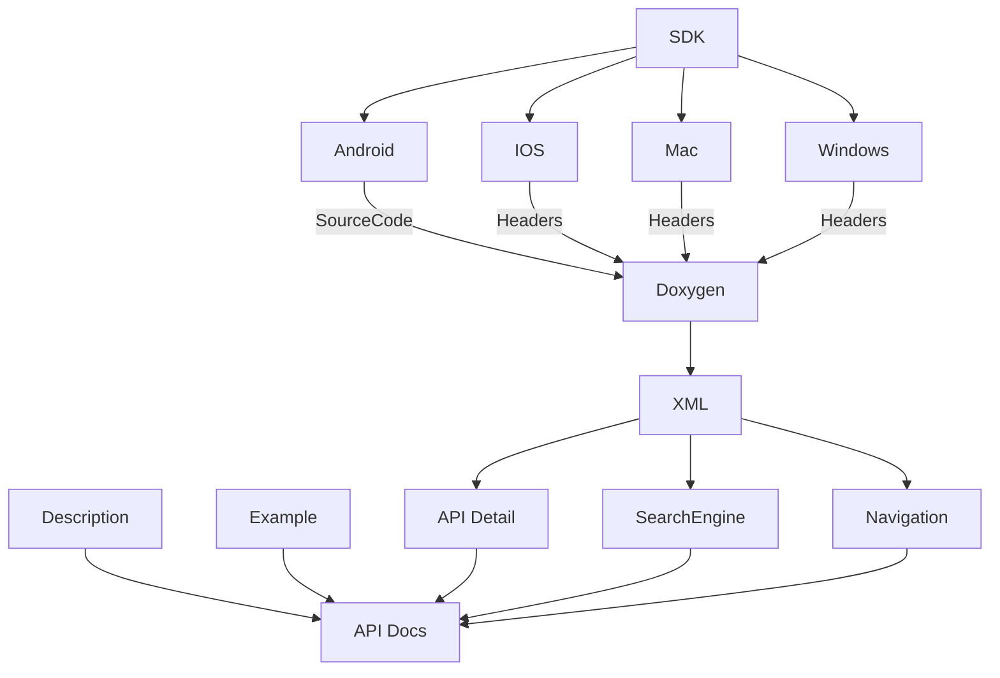
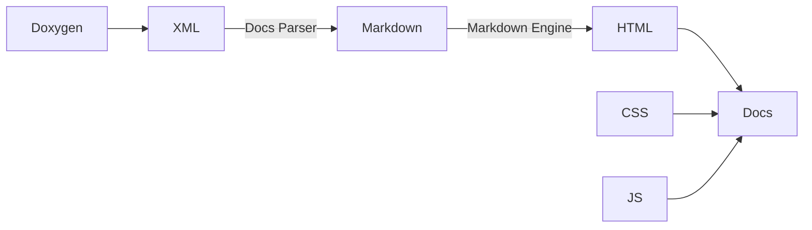
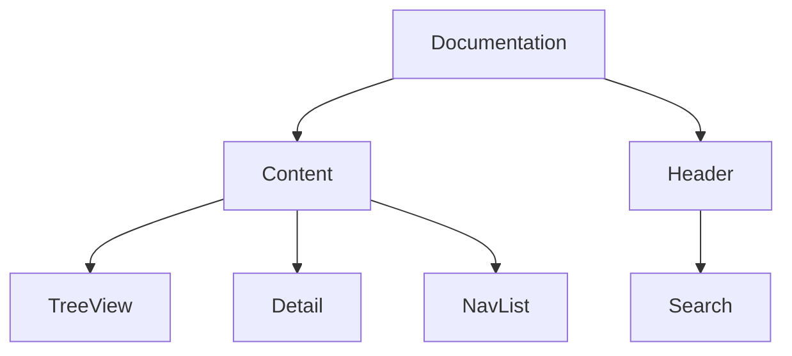

# Doxygen
通过 Doxygen 生成 XML 原始数据，然后通过 XML 生成 Markdown 文档格式，最后与 API 文档 HTML 模板组合，从而达到形式和 UI 布局等等一致的效果。
XML 原始数据还可以生成搜索功能模块，快速导航，目录树等等功能。
`Parser` 生成原始 HTML 生成文档，搜索等等功能通过 `ReactJS` 组件扩展实现。

## 为什么选择 Doxygen
- 项目成熟，开源社区支持
- 支持语言较多, 适用于C++、C、Java、Objective-C、Python、IDL（CORBA 和 Microsoft flavors）、Fortran、VHDL、PHP、C# 和 D
- 解析速度快

## Doxygen 不足之处
- UI 不够现代化美观
- 统一的 UI 界面
- 自定义文档扩展无法实现
- 搜索功能简陋
- 文档分类
- 更多交互功能

## Doxygen 文档开发流程


## 

## 前端编译流程


## 技术栈选择
- Docs Parser  (Doxygen)
- XML Parser (xml-js)
- UI (ReactJS)
- Script (TypeScript)
- HTML Template (ejs)
- Markdown Parser (markdown-it)

## 文档结构图


## HTML 结构
```html
  <body>
    <div id="app"></div>
    <div class="nav-wrapper"></div>
    <div class="content">
      <nav-tree class="nav-tree"></nav-tree>
      <div class="article-wrapper">
        <div class="breadcrumb-list"></div>
        <article class="markdown-body"><%- articleBody %></article>
      </div>
      <nav-quick-link class="nav-quick-link"></nav-quick-link>
    </div>
    <script type="text/javascript" src="<%- vendor %>" charset="utf-8"></script>
    <script type="text/javascript" src="<%- name %>" charset="utf-8"></script>
  </body>
```

## Parser 和自动化生成
- Parse XML
- Parse Markdown
- 文档内容解析
- Markdown 文件生成 
- HTML 文件生成
- ReactJS 组件开发


## 不同语言的分类

