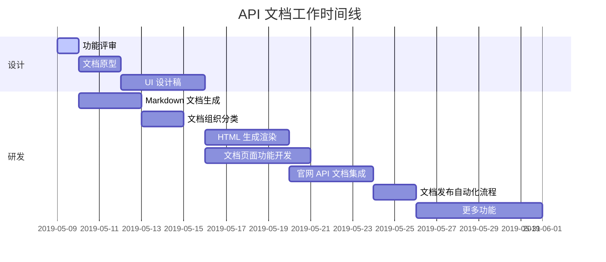

# 时间线

```mermaid
gantt
    title API 文档工作时间线
    dateFormat  YYYY-MM-DD

    section 设计
    功能评审: active, features, 2019-05-09, 1d
    文档原型: prototype, after features, 2d
    UI 设计稿: design, after prototype, 4d

    section 研发
    Markdown 文档生成: markdownParser, after features, 3d
    文档组织分类: categories, after markdownParser, 2d
    HTML 生成渲染: HTMLParser, after design, 4d
    文档页面功能开发: HTMLFeatures, after design, 5d
    官网 API 文档集成: docsCompile, after HTMLParser, 4d
    文档发布自动化流程: docsPublish, after docsCompile, 2d
    更多功能: moreFeatures, after docsPublish, 6d
```
